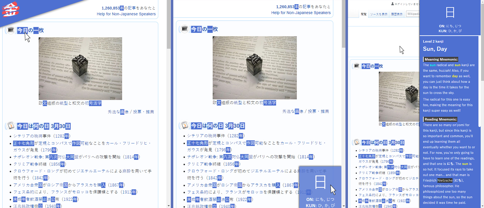

# WaniKani Kanji Highlighter
### Unofficial Chrome Extension

This is an unofficial chrome extension for Kanji Highlighting, matching the kanji learned with [WaniKani.com](https://www.wanikani.com/).
It works with any website, and provides detailed information about any kanji that is highlighted.
**Because it would be cheating, the extension doesn't work on [WaniKani.com](https://www.wanikani.com/).**

#### VERSION 0.4.4

## [Get it on Chrome Webstore](https://chrome.google.com/webstore/detail/wanikani-kanji-highlighte/pdbjikelneighjgjojikkmhiehpcokjm/)

## Table of contents:
1. [Latest Features](#changelog-v044)
2. [Usage Guide](#usage-guide)
   * 2.1. [WaniKani API Token](#wanikani-api-token)
   * 2.2. [Kanji Details](#kanji-details)
   * 2.3. [Kanji Search](#kanji-search)
   * 2.4. [Writing Kana](#writing-kana)
   * 2.5. [Blacklisting a Site](#blacklisting-a-site)
   * 2.6. [Settings](#settings)
3. [Pictures](#pictures)

## Changelog v0.4.4
Released on 30/07/2021

### Content
- Extension no longer counts repeated kanji on each page. This means that the number of kanji that is now being shown is only the number of different kanji in the page

### Popup
- Possibility to change the display of the kanji cards in the search result
    - List: one result per line with detailed info
    - Big and Small Grid: results in a grid but with no detailed info, only card with kanji
- The results of kanji search is now more broaden (i.e.: searching gold will also show GOLDfish)

## Changelog v0.4.3
Released on 02/06/2021

### Content
- Selecting any word in a page and then right clicking it will show an option in the context menu to allow the user to search for that word in the Search Bar in the extension popup
- Kanji counter in the extension icon doesn't have a cap of 99 kanji anymore

### Bug Fix
- The Kanji Info Popup is now the same in every page, and no longer gets all wrongly formated depending on the page it is in
- Fixed an issue where if you were to click a kanji from a Search Result while there is already a Kanji Info Popup open, the Bottom Right Kanji Popup would become unclickable

## Changelog v0.4.2
Released on 01/06/2021

### Content
- Hovering an item card in Kanji Info Popup now shows a small sidebar where you can open the Kanji Info Popup of that item or listen to the its audio, if it is a vocabulary
- With the implementation of the feature above, vocabulary now have a Kanji Info Popup (before this, only kanji had it). This new Kanji Info Popup has information about the vocabulary, such as mnemonics, example sentences with that vocabulary, etc...
- Kanji highlighted within the example sentences can be clicked, which creates a new Kanji Info Popup for that kanji

### Popup
- When clicking a result of a search that is a kanji, the info popup for that kanji will appear in the bottom right corner of the webpage, as if that kanji was highlighted and the user hovered over it

### Bug Fix
- Fix issue where the extension popup wouldn't load correctly and would stay that way

## Changelog v0.4.1
Released on 30/05/2021

### Bug Fixed
- Fixed bug where name of kanji wouldn't show up properly in the Kanji Info Popup

## Changelog v0.4.0
Released on 28/05/2021

### - Vocabulary is here!

### Content
- Kanji info that appears when hovering over a kanji now has every vocabulary word, provided by WaniKani, associated to that kanji

### Popup
- Implemented vocabulary results in Kanji Search
- When clicking the kanji of a result in Kanji Search, a new search will be made with the kanji that was clicked
- Improved Api Key text input to match the Kanji Search text input interface

#### [(All changelogs)](CHANGELOG.md)

## Usage Guide
### WaniKani API Token:
To run the Highlighter and get all the information about your progression in Kanji learning on WaniKani, you need to feed the extension with an API Token. If you don't know how to get it, here's a quick guide:
- Go to [WaniKani.com](https://www.wanikani.com/) and login
- Click on your profile picture and then on *API Tokens* within *Settings*
- Generate a new token. Give it any name you want
- Input the token, when asked, in the extension popup

### Kanji Details:
When you find a Kanji you already learned, it will be highlighted. If you hover over it with your mouse, a small square with the kanji and its readings will appear in the bottom right corner of the page. If you hover over that square, it will expand and show you detailed information like the meaning, mnemonics, etc..

If you hover over another highlighted kanji, the popup with the details will automatically update.

When you no longer wish to have the popup visible, you can click anywhere on the page not covered by it, and it will collapse.

### Kanji Search:
You can search for any Kanji and Vocabulary taught on WaniKani, even if you didn't learn it yet, through the search bar in the extension popup.

The search can be done by writing in the search bar in two ways, which can be toggled by clicking a button with either 'あ' or 'A':
- **Kana (きん):**
  - **Hiragana:** writing the reading in Hiragana (lowercase) will show all material with that reading (in the case of kanji it can be either kunyomi or onyomi)
- **Romaji/Kanji/Number (Gold/金/5):**
  - **Name of the kanji:** writing the name of a material will show immediately all matches for that name (sometimes, different kanji have the same name)
  - **Character of the Kanji:** writing the kanji itself, will show, not only that kanji, but all the similar kanji, and all vocabulary with that kanji
  - **Level:** writing a number 1-60 will show all material from that level

The result of the search is the character for the material, followed by its names, readings and level.
If it is a Kanji, then it will be on yellow, if it is a vocabulary, it will be on red.

### Writing Kana:
Within the search bar, if you change the writing type from Romaji to Kana, by clicking on the button with the character 'あ', everything you type with your keyboard on that search bar will be automatically converted to Kana. If you write in **Lower Case** then **Hiragana** will show up. If you write in **Uper Case** then **Katakana** will show up.

So, if you write **kya**, you will see **きゃ**. If you instead write **KYA**, you will se **キャ**.

"Special characters":
- **ぁぃぅぇぉ (small):** l+(a|i|u|e|o) or x+(a|i|u|e|o)
- **っ (small)**: ll or xx
- **ゃゅょ (small):** l+(ya|yu|yo) or x+(ya|yu|yo)
- **ん:** nn

(Same goes for all it's counterparts in **Katakana**, using Upper Case)

### Blacklisting a Site:
If you feel like the extension is being problematic on a specific website, or you simply don't want it to run in it, you can blacklist it on the extension popup. There will be a red button saying **Don't Run On This Site**.

You can blacklist multiple sites and, of course, you can allow the extension to run on it again, after it was blacklisted. There will be a red button saying **Run Highlighter On This Site**.

The changes will take place right after you reload the page.

You can see the list of blacklisted sites in *Settings*, within the extension popup.

### Settings:
On the extension popup, you will find the app settings.
- **Kanji info popup:** show the popup with the details of a highlighted kanji, when hover over it
- **Kanji counter on icon:** show the number of highlighted Kanji in the page on the icon of the extension (doesn't count above *99* kanji for readability purposes)
- **Highlight style:** choose how do you want the kanji to be highlighted

## Pictures

