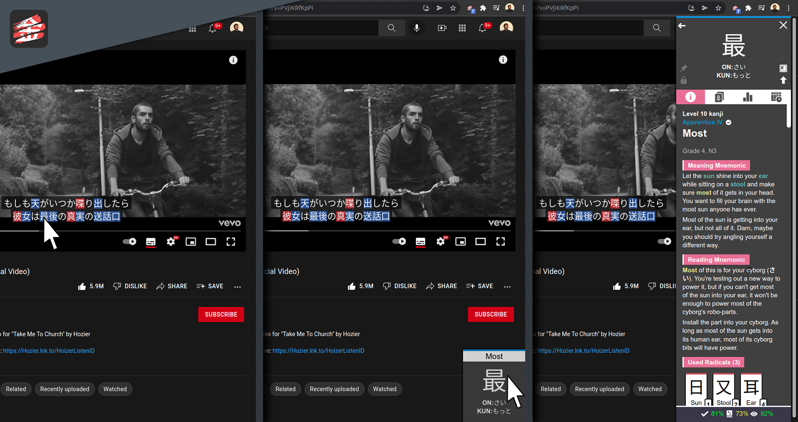
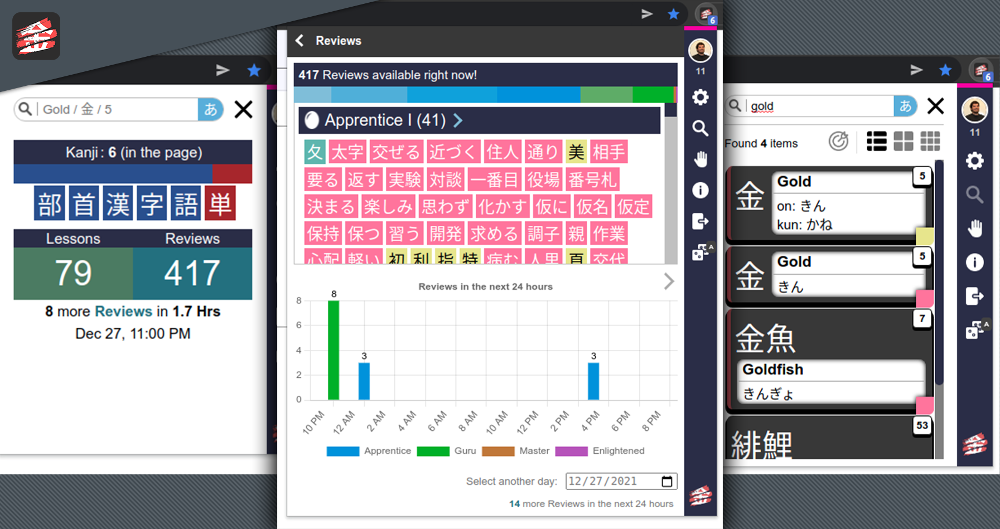

# WaniKani Kanji Highlighter

### Unofficial Browser Extension

This is an unofficial extension for the browser for Kanji Highlighting, matching the kanji learned with [WaniKani.com](https://www.wanikani.com/).
It works with any website, and provides detailed information about any kanji that is highlighted.
**Because it would be "cheating", the extension doesn't work on [WaniKani.com](https://www.wanikani.com/).**

## [Get it on Chrome Webstore](https://chrome.google.com/webstore/detail/wanikani-kanji-highlighte/pdbjikelneighjgjojikkmhiehpcokjm/)

## [Get it on Mozilla Add-ons](https://addons.mozilla.org/pt-PT/firefox/addon/wanikani-kanji-highlighter/)

## Table of contents:

1. [Latest Features](#changelog-v067)
2. [Usage Guide](#usage-guide)
   - 2.1. [WaniKani API Token](#wanikani-api-token)
   - 2.2. [Kanji Details](#kanji-details)
     - 2.2.1 [Shortcut Keys](#shortcut-keys)
   - 2.3. [Subject Search](#subject-search)
   - 2.4. [Writing Kana](#writing-kana)
   - 2.5. [Lessons and Reviews](#lessons-and-reviews)
   - 2.6. [Blacklisting a Site](#blacklisting-a-site)
   - 2.7. [Settings](#settings)
3. [Pictures](#pictures)

## [Changelog v0.6.7]()

### Popup
- Added navbar to Changelogs list in the About page

## Changelog v0.6.6

Released on 11/08/2022

### Popup
- Added Copy to Clipboard button to API Key on About page

### Content
- Added Copy to Clipboard buttons to the main subject of lateral Details Popup and to each subject related to that main subject

### Bug Fixes
- Previous Subject arrow on lateral Details Popup now is always visible to prevent a bug where it wouldn't show up, even when there were previous subjects
- Navbar on lateral Details Popup now scrolls to each section without affecting the main webpage (some webpages would react badly to url hash changes when using anchor links and reload the page) 

## Changelog v0.6.5

Released on 10/03/2022

### Popup
- Reduced loading times
- Removed subject info when hovering on subjects in profile, while at Wanikani

### Bug Fixes
- Fixed issue where highlighted kanji would show on extension popups opened in other tabs (not only on the popup opened on their tab)

## Changelog v0.6.4

Released on 06/03/2022

### Popup
- Changed the way the loading of subjects is being done to reduce significantly it's time
- Added Profile Page to Extension Popup, accessible by clicking the Avatar on the top right corner, in the side panel. This allows to:
  - See all subjects on your curret level
  - Filter and sort those subjects
  - See subjects from other levels
- Added Star to the top right corner of every secundary page that allows to make that page the Home Page of the Extension Popup

## Changelog v0.6.3

Released on 25/02/2022

### Popup
- Slider on settings to change width of extension popup
- Precise search switch button now works on kana writing and kanji (before, it was always precise)
- Sliders on settings now work with mouse wheel too (shift + wheel increases scale)
- Activating kana writing on text inputs of a web page no longer requires page reload (activation and deactivation happens in real time now)
- Some containers within the extension popup have been made resizable
- Bar with status of Highlighting and Details Popup (if those features are active or not)
- Removed old interface (not accessibable through the X button on the top right anymore)
- Small changes on buttons to blacklist a site to fit most recent interface
- Added overall progression bar on each SRS Stage
- Added overall progression stats (number of subjects) on each SRS Stage
- Added levels in progress stats
- Possibility to chose, through settings, what to show in the home page of the extension popup

### Content
- Added button to play sound of reading to the details popup of any vocabulary
- Added real time color change to details popup, when changing it from the settings of the extension popup

### Bug Fixes
- Clicking on a search result while on kana writing mode now searches for that result (before, it only worked while on romaji mode)
- Fixed issue where list of highlighted kanji wouldn't show up if extension popup was opened too soon
- Fixed issue where search on extension popup wouldn't load subjects when clicking to change type of input (from Romaji to Kana)
- Improved kana writing to fix some bugs with situations like "しゅっしゃ" and "かんじ" (when written as kanji instead of kannji)
- Fixed issue where the bars stating the number of highlighted kanji wouldn't show up or not update automaticaly
- Fixed issue where highlight wouldn't work if you changed tabs before page loaded
- Improved verifications to reduce times when highlight runs when it shouldn't

## Changelog v0.6.2

Released on 29/12/2021

### Popup
- Added SRS Stage to extension popup search results
- Changed style of search result cards
- Added button to side panel to get random subject (type of subject - kanji, vocabulary or any - can be specified in settings)

### Content
- Added SRS Stage information to details popup
- Added Timestamp Statistics to details popup
- Added Reviews Statistics to details popup
- Added Parts of Speech and JLPT and Joyo levels to details popup
- Changed the overall style of details popup
- Added navigation bar to details popup
- Added shortcut keys to interact with details popup navigation bar:
  - **I:** Navigate to Info Section
  - **C:** Navigate to Cards Section
  - **S:** Navigate to Reviews Statistics Section
  - **T:** Navigate to Timestamps Section
  - **<-:** Navigate to Previous Section
  - **->:** Navigate to Next Section
- Added button in details popup to deactivate key bindings
- Added slider to settings to set the opacity of the small details popup
- Option to write with kana on webpage text inputs

### Bug Fixes
- Fixed issue where subject data wasn't being loaded the first time the extension run
- Notifications now show subjects numbers updated
- Adjusted extension popup interactions when at wanikani.com
- Fixed issue where the extension would hide, by mistake, some things on web pages

## Changelog v0.6.1

Released on 15/12/2021

### Bug Fixes

- Assignment material shown in reviews/lessons list now match the real number of assigments (only showing up to 500 assignments before, due to a bug)

## Changelog v0.6.0

Released on 16/11/2021

### Content

- Notifications to remind you to practice daily
- Used Kanji in Details Popup is no longer sorted by level, but by its position in the vocabulary subject (as it was before)
- Added highlighting to elements from within an iframe (only to those iframes that allow it)

### Popup

- New side panel that is more interactive and gives a refreshed look to the app (can be activated by clicking the hamburger menu, or switched back to the old interface)
- New About page with information regarding the App, and more

#### [(All changelogs)](CHANGELOG.md)

## Usage Guide

### WaniKani API Token:

To run the Highlighter and get all the information about your progression in Kanji learning on WaniKani, you need to feed the extension with an API Token. If you don't know how to get it, here's a quick guide:

- Go to [WaniKani.com](https://www.wanikani.com/) and login
- Click on your profile picture and then on _API Tokens_ within _Settings_
- Generate a new token. Give it any name you want
- Input the token, when asked, in the extension popup

### Kanji Details:

When you find a Kanji you already learned, it will be highlighted. If you hover over it with your mouse, a small square with the kanji and its readings will appear in the bottom right corner of the page. If you hover over that square, it will expand and show you detailed information like the meaning, mnemonics, etc..

If you hover over another highlighted kanji, the popup with the details will automatically update.

When you no longer wish to have the popup visible, you can click anywhere on the page not covered by it, and it will collapse.

#### Shortcut Keys:

There a few shortcut keys that allow you to interact with the details popup through your keyboard. The shortcuts are:

- **L**: Lock the kanji in the details popup, meaning it won't change when hover over other kanji (might come in hand when your mouse is surrounded by several highlighted kanji)
- **F**: Fix the kanji details popup, not allowing it to close when clicking outside of it
- **X**: Close the kanji details popup
- **O**: Expand the small kanji details popup on the bottom right corner
- **U**: Scroll the kanji details popup all the way to the top
- **B**: Show information from the last kanji in the details popup
- **I:** Navigate to Info Section
- **C:** Navigate to Cards Section
- **S:** Navigate to Reviews Statistics Section
- **T:** Navigate to Timestamps Section
- **<-:** Navigate to Previous Section
- **->:** Navigate to Next Section

This shortcuts will collide with any shortcut that might already exist in the page you're in.

### Subject Search:

You can search for any Kanji or Vocabulary taught on WaniKani, even if you didn't learn it yet, through the search bar in the extension popup.

The search can be done by writing in the search bar in two ways, which can be toggled by clicking a button with either 'あ' or 'A':

- **Kana (きん):**
  - **Hiragana:** writing the reading in Hiragana (lowercase) will show all material with that reading (in the case of kanji it can be either kunyomi or onyomi)
- **Romaji/Kanji/Number (Gold/金/5):**
  - **Name of the kanji:** writing the name of a material will show immediately all matches for that name (sometimes, different kanji have the same name)
  - **Character of the Kanji:** writing the kanji itself, will show, not only that kanji, but all the similar kanji, and all vocabulary with that kanji
  - **Level:** writing a number 1-60 will show all material from that level

The display of the results can be one of three options:

- Vertically listed material (one per line), followed by its names, readings and level
- Medium sized squares with only the material kanji
- Small sized squares with only the material kanji

If it is a Kanji, then it will be on yellow, if it is a vocabulary, it will be on red.

The search results can be more or less broaden, by clikcing the targeted search icon within the search area. If activated, then only material with the exact same text as what was typed will show up. Otherwise, material with similar text will also appear (i.e.: if you search for gold, if targeted search is not activated, then goldfish will be one of the search results because it contains the word gold).

Writing the word "legacy" in the seach bar will show all subjects that no longer show up in lessons or reviews.

### Writing Kana:

Within the search bar, if you change the writing type from Romaji to Kana, by clicking on the button with the character 'あ', everything you type with your keyboard on that search bar will be automatically converted to Kana. If you write in **Lower Case** then **Hiragana** will show up. If you write in **Uper Case** then **Katakana** will show up.

So, if you write **kya**, you will see **きゃ**. If you instead write **KYA**, you will se **キャ**.

"Special characters":

- **ぁぃぅぇぉ (small):** l+(a|i|u|e|o) or x+(a|i|u|e|o)
- **っ (small)**: ll or xx
- **ゃゅょ (small):** l+(ya|yu|yo) or x+(ya|yu|yo)
- **ん:** nn

(Same goes for all it's counterparts in **Katakana**, using Upper Case)

### Lessons and Reviews:

The extension popup gives you some information about lessons and reviews in WaniKani.

The main page shows the number of lessons and reviews available, and when more reviews will enter the queue. By clicking in the number os lessons or reviews, more detailed information is provided.

- **Lessons:**
  - List of materials in queue to learn

- **Reviews:**
  - List of materials in queue to review
  - Chart showing the future reviews in the next 24 hours

### Blacklisting a Site:

If you feel like the extension is being problematic on a specific website, or you simply don't want it to run in it, you can blacklist it on the extension popup. There will be a red button saying **Don't Run On This Site**.

You can blacklist multiple sites and, of course, you can allow the extension to run on it again, after it was blacklisted. There will be a red button saying **Run Highlighter On This Site**.

The changes will take place right after you reload the page.

You can see the list of blacklisted sites in _Settings_, within the extension popup.

### Settings:

By clicking in the gear icon in the main page of the extension popup, you will find the app settings.

- **Kanji Details Popup**
  - **Activated:** show the popup with the details of a highlighted kanji, when hover over it
  - **Key Bindings:** choose whether to activate or not the key bindings on details popup
  - **Random Subject:** select the type of subject expected when getting a random subject (any, kanji or vocabulary)
  - **Popup Opacity:** change the opacity of the small details popup
- **Notifications**
  - **New Reviews:** notification triggered whenever there are new Reviews in the queue
  - **Practice Reminder:** notification reminding the ammount of assignments that are available at a specific time of the day chosen by the user
  - **Searching a Webpage Word:** notification triggered whenever searching a word from within any webpage
- **Extension Popup Interface**
  - **Scripts Status:** show scripts status in the extension popup home
  - **Highlighted Kanji:** show kanji highlighted in the current page in the extension popup home
  - **Lessons and Reviews:** show number of lessons and reviews in the extension popup home
  - **Overall Progression Bar:** show progression bar for each SRS Stage in the extension popup home
  - **Overall Progression Stats:** show numbers for each SRS Stage in the extension popup home
  - **Levels In Progress:** show which levels still have subjects in progress in the extension popup home
- **Miscellaneous**
  - **Time in 12h Format:** timestamps within the chrome extension are in the 12h format (24h format if disabled)
  - **Kana Writing:** write kana on text inputs on a webpage (some inputs might not work)
  - **Extension Popup Width:** change the width of the extension popup window
- **Extension Icon**
  - **Kanji Counter:** show the number of highlighted Kanji in the page, on the icon of the extension
- **Highlight Style:** choose how do you want the kanji to be highlighted
- **Appearance:** customize the color of several features in the app (highlight, kanji cards, etc...)
- **Danger Section**
  - **Clear Subjects Data:** clear only locally storaged data from subjects. This will not affect your WaniKani account!
  - **Clear All:** clear all locally storaged data. This will not affect your WaniKani account!

## Pictures

