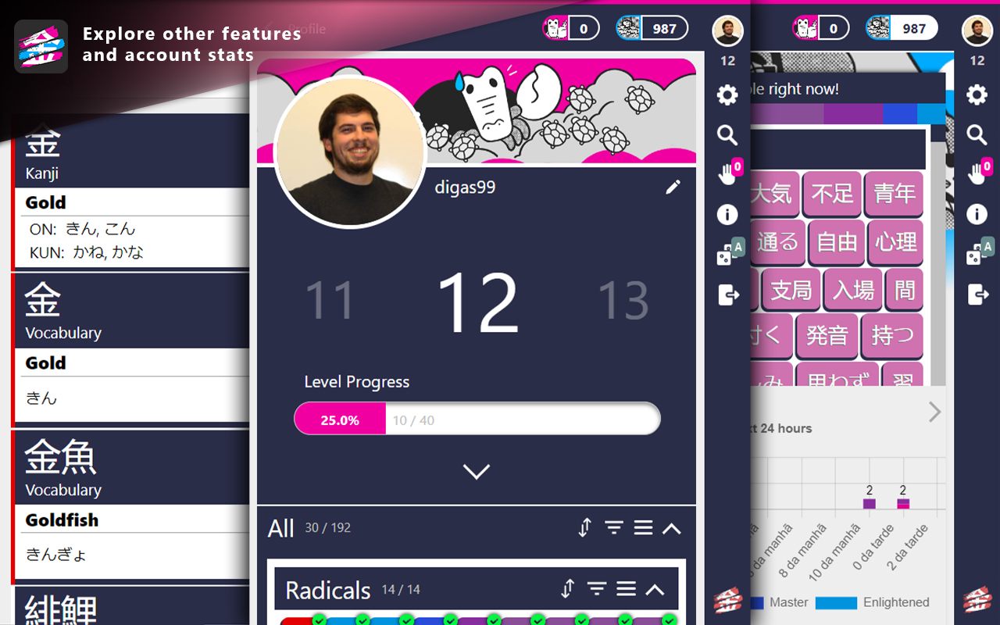

# WaniKani Kanji Highlighter
### Unofficial Browser Extension

This is an unofficial extension for the browser for Kanji Highlighting, matching the kanji learned with [WaniKani.com](https://www.wanikani.com/).
It works with any website, and provides detailed information about any kanji that is highlighted.
**Because it would be "cheating", the extension doesn't work on [WaniKani.com](https://www.wanikani.com/).**

#### VERSION 0.6.1

## [Get it on Chrome Webstore](https://chrome.google.com/webstore/detail/wanikani-kanji-highlighte/pdbjikelneighjgjojikkmhiehpcokjm/)
## [Get it on Mozilla Add-ons](https://addons.mozilla.org/pt-PT/firefox/addon/wanikani-kanji-highlighter/)

## Table of contents:
1. [Latest Features](#changelog-v061)
2. [Usage Guide](#usage-guide)
   * 2.1. [WaniKani API Token](#wanikani-api-token)
   * 2.2. [Kanji Details](#kanji-details)
     * 2.2.1 [Shortcut Keys](#shortcut-keys)
   * 2.3. [Kanji Search](#kanji-search)
   * 2.4. [Writing Kana](#writing-kana)
   * 2.5. [Lessons and Reviews](#lessons-and-reviews)
   * 2.6. [Blacklisting a Site](#blacklisting-a-site)
   * 2.7. [Settings](#settings)
3. [Pictures](#pictures)

# Changelog v0.6.1
Released on 15/12/2021

## Bug Fix
- Assignment material shown in reviews/lessons list now match the real number of assigments (only showing up to 500 assignments before, due to a bug)

## Changelog v0.6.0
Released on 16/11/2021

### Content
- Notifications to remind you to practice daily
- Used Kanji in Details Popup is no longer sorted by level, but by its position in the vocabulary subject (as it was before)
- Added highlighting to elements from within an iframe (only to those iframes that allow it)

### Popup
- New side panel that is more interactive and gives a refreshed look to the app (can be activated by clicking the hamburger menu, or switched back to the old interface)
- New About page with information regarding the App, and more

#### [(All changelogs)](CHANGELOG.md)

## Usage Guide
### WaniKani API Token:
To run the Highlighter and get all the information about your progression in Kanji learning on WaniKani, you need to feed the extension with an API Token. If you don't know how to get it, here's a quick guide:
- Go to [WaniKani.com](https://www.wanikani.com/) and login
- Click on your profile picture and then on *API Tokens* within *Settings*
- Generate a new token. Give it any name you want
- Input the token, when asked, in the extension popup

### Kanji Details:
When you find a Kanji you already learned, it will be highlighted. If you hover over it with your mouse, a small square with the kanji and its readings will appear in the bottom right corner of the page. If you hover over that square, it will expand and show you detailed information like the meaning, mnemonics, etc..

If you hover over another highlighted kanji, the popup with the details will automatically update.

When you no longer wish to have the popup visible, you can click anywhere on the page not covered by it, and it will collapse.

#### Shortcut Keys:
There a few shortcut keys that allow you to interact with the details popup through your keyboard. The shortcuts are:
- **L**: Lock the kanji in the details popup, meaning it won't change when hover over other kanji (might come in hand when your mouse is surrounded by several highlighted kanji)   
- **F**: Fix the kanji details popup, not allowing it to close when clicking outside of it
- **X**: Close the kanji details popup
- **O**: Expand the small kanji details popup on the bottom right corner
- **U**: Scroll the kanji details popup all the way to the top
- **B**: Show information from the last kanji in the details popup

This shortcuts will collide with any shortcut that might already exist in the page you're in.

### Kanji Search:
You can search for any Kanji and Vocabulary taught on WaniKani, even if you didn't learn it yet, through the search bar in the extension popup.

The search can be done by writing in the search bar in two ways, which can be toggled by clicking a button with either 'あ' or 'A':
- **Kana (きん):**
  - **Hiragana:** writing the reading in Hiragana (lowercase) will show all material with that reading (in the case of kanji it can be either kunyomi or onyomi)
- **Romaji/Kanji/Number (Gold/金/5):**
  - **Name of the kanji:** writing the name of a material will show immediately all matches for that name (sometimes, different kanji have the same name)
  - **Character of the Kanji:** writing the kanji itself, will show, not only that kanji, but all the similar kanji, and all vocabulary with that kanji
  - **Level:** writing a number 1-60 will show all material from that level

The display of the results can be one of three options:
- Vertically listed material (one per line), followed by its names, readings and level
- Medium sized squares with only the material kanji
- Small sized squares with only the material kanji

If it is a Kanji, then it will be on yellow, if it is a vocabulary, it will be on red.

The search results can be more or less broaden, by clikcing the targeted search icon within the search area. If activated, then only material with the exact same text as what was typed will show up. Otherwise, material with similar text will also appear (i.e.: if you search for gold, if targeted search is not activated, then goldfish will be one of the search results because it contains the word gold).

### Writing Kana:
Within the search bar, if you change the writing type from Romaji to Kana, by clicking on the button with the character 'あ', everything you type with your keyboard on that search bar will be automatically converted to Kana. If you write in **Lower Case** then **Hiragana** will show up. If you write in **Uper Case** then **Katakana** will show up.

So, if you write **kya**, you will see **きゃ**. If you instead write **KYA**, you will se **キャ**.

"Special characters":
- **ぁぃぅぇぉ (small):** l+(a|i|u|e|o) or x+(a|i|u|e|o)
- **っ (small)**: ll or xx
- **ゃゅょ (small):** l+(ya|yu|yo) or x+(ya|yu|yo)
- **ん:** nn

(Same goes for all it's counterparts in **Katakana**, using Upper Case)

### Lessons and Reviews:
The extension popup gives you some information about lessons and reviews in WaniKani.

The main page shows the number of lessons and reviews available, and when more reviews will enter the queue. By clicking in the number os lessons or reviews, more detailed information is provided.

- **Lessons:**
  - List of materials in queue to learn

- **Reviews:**
  - List of materials in queue to review
  - Chart showing the future reviews in the next 24 hours

### Blacklisting a Site:
If you feel like the extension is being problematic on a specific website, or you simply don't want it to run in it, you can blacklist it on the extension popup. There will be a red button saying **Don't Run On This Site**.

You can blacklist multiple sites and, of course, you can allow the extension to run on it again, after it was blacklisted. There will be a red button saying **Run Highlighter On This Site**.

The changes will take place right after you reload the page.

You can see the list of blacklisted sites in *Settings*, within the extension popup.

### Settings:
By clicking in the gear icon in the main page of the extension popup, you will find the app settings.
- **Kanji Details Popup** 
  - **Activated:** show the popup with the details of a highlighted kanji, when hover over it
- **Extension Icon**
  - **Kanji Counter:** show the number of highlighted Kanji in the page, on the icon of the extension
- **Notifications**
  - **New Reviews** notification triggered whenever there are new Reviews in the queue
  - **Practice Reminder** notification reminding the ammount of assignments that are available at a specific time of the day chosen by the user
  - **Searching a Webpage Word** notification triggered whenever searching a word from within any webpage
- **Miscellaneous**
  - **Time in 12h Format** timestamps within the chrome extension are in the 12h format (24h format if disabled)
- **Highlight Style:** choose how do you want the kanji to be highlighted
- **Appearance:** customize the color of several features in the app (highlight, kanji cards, etc...)
- **Danger Section**
  - **Clear Cache:** clear local data storage. This will not affect your WaniKani account!

## Pictures

